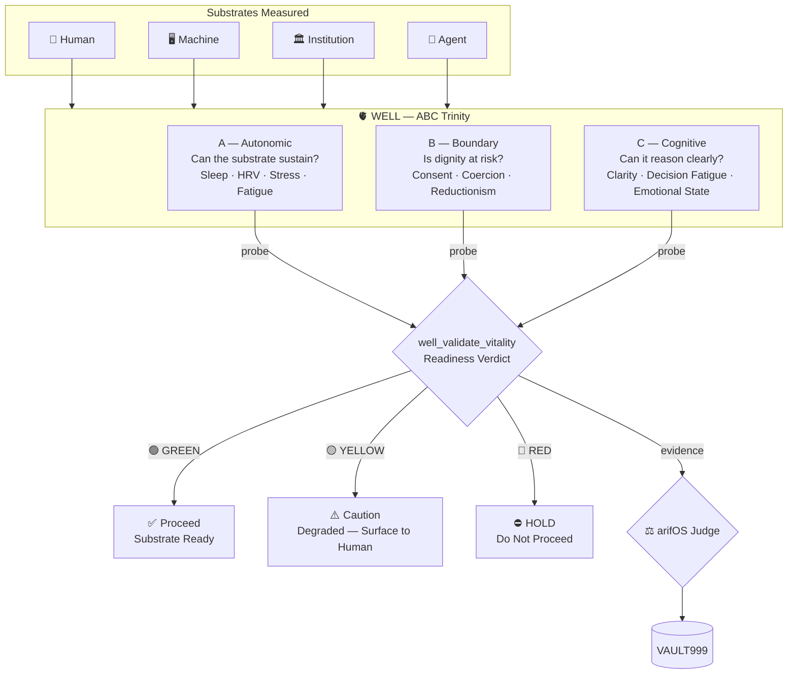

<!-- SOT-MANIFEST
federation_release: v2026.07.24
last_verified: 2026-07-24T07:45Z
live_commit: 31e8af2
port: 18083
mcp_tools_live: 8
authority: REFLECT_ONLY — never diagnose, never adjudicate
health_status: DEGRADED (apex_scalars UNMEASURED — known, non-blocking)
truth_rule: tools/list + /health beat any static count in prose
-->

[](https://github.com/ariffazil/well/actions/workflows/agentic-ci.yml)
[](https://well.arif-fazil.com/mcp)
[](https://arifos.arif-fazil.com)
[](LICENSE)

# 🫀 WELL — Substrate Readiness Intelligence

> **WELL reflects whether the substrate is ready. It never diagnoses.**
> **Human testimony remains authoritative. Sensors are evidence, not truth.**
> **DITEMPA BUKAN DIBERI**

---

## TL;DR — Three Audiences

**For human operators (Arif):** WELL is your readiness mirror — sleep, fatigue, cognitive clarity, dignity boundaries. It reflects your state. You interpret it. Never let WELL readings override what you know about yourself. [§1](#1-what-well-is)

**For AI agents:** Before any irreversible action, probe WELL. GREEN → proceed. YELLOW → caution. RED → HOLD. Never treat WELL output as medical advice. [§8](#8-for-ai-agents)

**For institutions:** WELL is the REFLECT_ONLY organ — it measures readiness across human, machine, and institutional substrates. Zero diagnostic authority. [§9](#9-for-institutions)

---

## 1. What WELL Is

WELL is the **substrate readiness organ** of the arifOS Federation. It reflects the condition of whatever is carrying the load — whether human, machine, institution, or agent — before irreversible action occurs.

Many failures are not caused by bad geology or bad economics. They occur because the human, machine, or institution executing the decision was not ready. WELL exists to reflect readiness before the next step.

| ✅ REFLECTS | ❌ NEVER |
|-------------|---------|
| Sleep quality, fatigue, stress load | Diagnoses medical conditions |
| Cognitive clarity, decision fatigue | Prescribes treatments |
| Dignity preservation, coercion signals | Overrides human self-reporting |
| Machine/tool/institutional reliability | Makes claims about health |
| Federation readiness (GREEN/YELLOW/RED) | Self-authorizes |

**Domain law:** REFLECT_ONLY — reflect, never diagnose, never adjudicate.

### Why WELL Exists

```
GEOX asks:     What is real?              (truth of earth)
WEALTH asks:   What are the consequences?  (truth of capital)
WELL asks:     Can the substrate safely    (truth of readiness)
               absorb the next action?
```

Three organs. Three angles on the same question: *should we act?*

### The Sovereignty Principle

> **Never override Arif's self-reported state with WELL readings.**

Most systems treat sensors as superior to human testimony. WELL inverts this: human self-reporting is authoritative. Sensors are evidence — they may corroborate or challenge, but they never replace. This is the constitutional difference between a vitality mirror and a surveillance tool.

### Substrates WELL Reflects

WELL does not only reflect human state. It reflects readiness across:

| Substrate | What It Measures | Example Tools |
|-----------|-----------------|---------------|
| **Human** | Sleep, fatigue, stress, cognitive clarity, dignity | `well_assess_homeostasis`, `well_guard_dignity` |
| **Machine** | Tool health, server reliability, drift detection | `well_assess_reliability`, `well_registry_status` |
| **Institution** | Governance integrity, trust decay, boundary health | `well_classify_substrate` |
| **Agent** | Decision readiness, authority boundaries, NIAT | `well_validate_vitality` |

---

## 2. The ABC Trinity

WELL observes readiness through three lenses:

| Lens | Question | Signals |
|------|----------|---------|
| **A — Autonomic** | Can the substrate sustain operation? | Sleep debt, HRV, stress load, chronic fatigue |
| **B — Boundary** | Is dignity, consent, or coercion at risk? | Dignity preservation, coercion signals, reductionism risk |
| **C — Cognitive** | Can the substrate reason clearly? | Cognitive clarity, decision fatigue, emotional state |

These three dimensions form the organizing framework for every WELL assessment. A substrate that passes Autonomic but fails Boundary is not ready. A substrate that passes Cognitive but fails Autonomic is not ready. Readiness requires all three.



---

## 3. Federation Position

```
Arif (F13) → AAA → arifOS → Domain Organs → A-FORGE → VAULT999
                                ↑
                           WELL (:18083)
                           Reflects, never diagnoses
```

### Federation Identity

| Organ | Domain | Question | Law |
|-------|--------|----------|-----|
| **GEOX** | Earth Intelligence | What is real? | Evidence-only |
| **WEALTH** | Capital Intelligence | What are the consequences? | Compute, never allocate |
| **WELL** | Readiness Intelligence | Can the substrate proceed? | Reflect, never diagnose |

---

## 4. Tools (8 Public Canonical)

| Category | Tools | Purpose |
|----------|-------|---------|
| **Homeostasis** | `well_assess_homeostasis` | Sleep, fatigue, stress, emotional state |
| **Vitality** | `well_validate_vitality` | Readiness verdict, NIAT, GREEN/YELLOW/RED |
| **Substrate** | `well_classify_substrate` | Boundary sensing, substrate classification |
| **Dignity** | `well_guard_dignity` | Consent, coercion signals, reductionism risk |
| **Trace** | `well_trace_lineage` | Memory, trend, ledger, vault chain tracing |
| **Reliability** | `well_assess_reliability` | Machine, tool, and institutional reliability |
| **Repair** | `well_check_repair` | Recovery, resilience, forge cycle integrity |
| **Registry** | `well_registry_status` | Tool surface truth diagnostic |

---

## 5. Quick Start

```bash
# Health
curl -s http://localhost:18083/health | python3 -m json.tool

# MCP connection
# Endpoint: https://well.arif-fazil.com/mcp

# Install + test
cd /root/WELL && pip install -e .
pytest tests/ -q --tb=short
```

---

## 6. Constitutional Binding

WELL enforces the **medical boundary** — `tests/test_medical_boundary.py` verifies that no `well_assess_*` tool ever emits a diagnosis. This is a hard constitutional gate. WELL reflects readiness; it does not interpret health.

| Floor | Application |
|-------|------------|
| F2 TRUTH | Every reflection carries epistemic label (OBS/DER/INT) |
| F6 MARUAH | Dignity-first — ASEAN/MY human context, consent, coercion awareness |
| F9 ANTI-HANTU | No medical claims, no phantom authority, no diagnostic speech |
| F10 ONTOLOGY | Reflects substrate state, never claims knowledge of personhood |

---

## 7. Federation Cross-Reference

| Organ | Role | Port | Repo |
|-------|------|------|------|
| arifOS | Constitutional kernel | 8088 | [ariffazil/arifos](https://github.com/ariffazil/arifos) |
| AAA | State + cockpit | 3001 | [ariffazil/AAA](https://github.com/ariffazil/AAA) |
| A-FORGE | Execution shell | 7071 | [ariffazil/A-FORGE](https://github.com/ariffazil/A-FORGE) |
| GEOX | Earth intelligence | 8081 | [ariffazil/geox](https://github.com/ariffazil/geox) |
| WEALTH | Capital intelligence | 18082 | [ariffazil/wealth](https://github.com/ariffazil/wealth) |
| **WELL** | Readiness intelligence | 18083 | ← you are here |

---

## 8. Build, Test, Deploy

```bash
pip install -e .
pytest tests/ -q --tb=short
systemctl restart well
curl -s http://localhost:18083/health | python3 -m json.tool
```

---

## 9. For AI Agents

1. Probe WELL before any irreversible action — `well_validate_vitality(mode="readiness")`
2. GREEN → proceed · YELLOW → caution · RED → HOLD
3. Never interpret WELL output as medical truth
4. **Never override Arif's self-reported state with WELL readings**
5. `well_medical_boundary()` is called before any "is X healthy?" question
6. Readiness across all substrates: a healthy human on a failing machine is not ready

---

## 10. For Institutions

| Property | How WELL delivers |
|----------|------------------|
| **REFLECT_ONLY** | Zero diagnostic authority — hard constitutional boundary |
| **Medical boundary tested** | `test_medical_boundary.py` verifies no diagnosis emission |
| **Multi-substrate** | Human, machine, institutional, and agent readiness |
| **Dignity-first** | ASEAN/MY cultural context — maruah, consent, coercion awareness |
| **Sovereign authority** | Human self-reporting always beats sensor readings |

---

## 11. License & Sovereignty

**AGPL-3.0.** WELL reflects under sovereign authority. It never diagnoses.

**Muhammad Arif bin Fazil** is F13 SOVEREIGN. Only he knows his own state.

```
WELL · Port 18083 · 8 tools · REFLECT_ONLY · AGPL-3.0
Reflects, never diagnoses. DITEMPA BUKAN DIBERI.
```

---

*Maintained under F13 SOVEREIGN by Muhammad Arif bin Fazil.*
*DITEMPA BUKAN DIBERI — Readiness is reflected, never diagnosed.*
